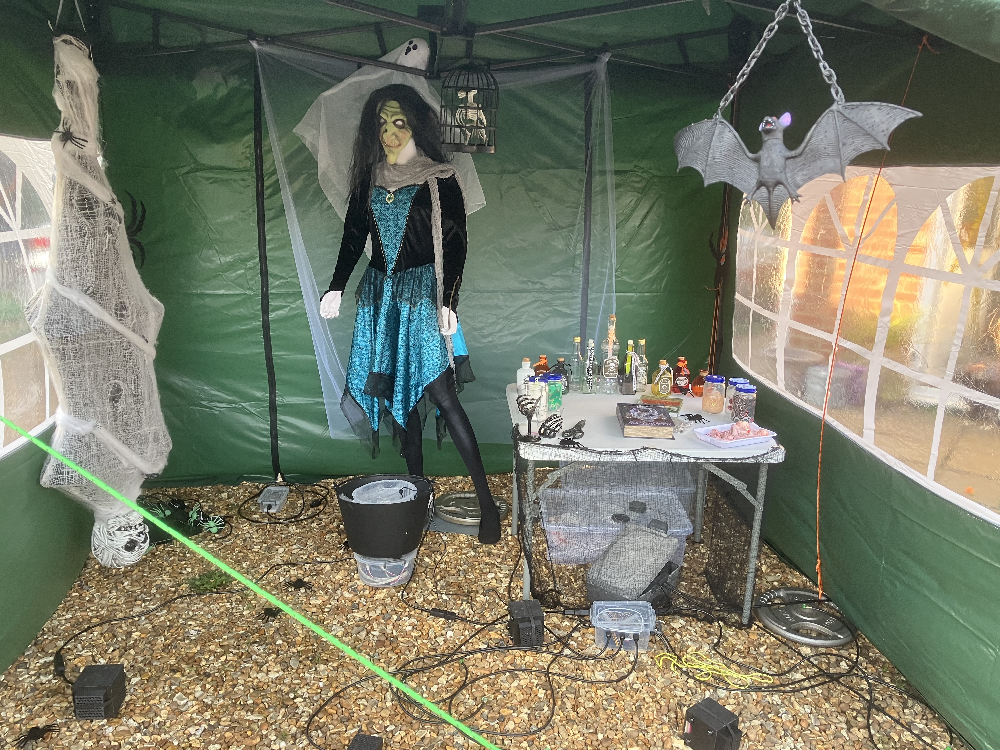

# Overview of 2025

This year, I've taken two days off during half-term to allow
a little more time to prepare the halloween display. To see
progress, I've taken a few photos as I've gone along. Enjoy.

## Day 1 - Thursday 30th October

This shows the triangular flower bed containing lots of
pumpkins that have been neatly carved by Amelia and
Lesley. The skeleton is also out sunbathing and toasting a
marshmallow of two. On the left you can see the car which
is where the witches house (gazebo) will go.

This shows the pathway and front door. The path skulls have
not been installed today as that is one of tomorrows jobs.

And the graveyard with the head stones all set out. Some of
the spiders have been put out but tomorrow will see the smoke
machine, projectors and thunder and lightning effects installed.

## Day 2 - Friday 31st October

This shows the gazebo on the drive which is being converted
into the witches house. The weather was not playing nice with
quite high gusts of wind. This meant I had to spend a lot of
time with extra ropes, weights and supports.

Close up of Mr Bones toasting marshmallows on the fire prop
that I made for the school play earlier this year.

The big mess of wires that is the main controller unit for
the right hand side of the path.

