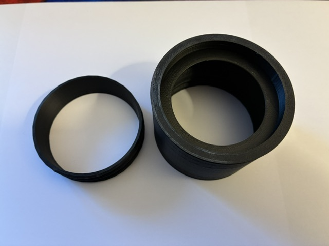
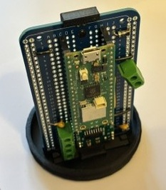
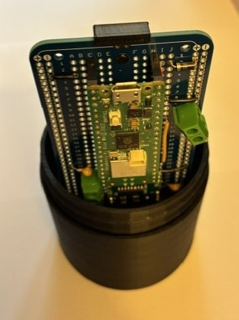
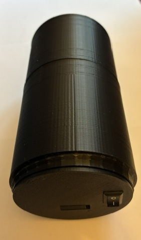
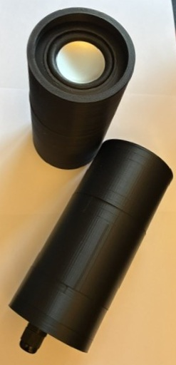

# 3D models for the Mark III speaker nodes

The Mark III nodes are a new design where all parts are 3D printed and
can be screwed together. This makes it much easier to assemble the devices
and use the same parts for different types of boxes. The first version of
the speaker box has:

* A housing for a speaker - light blue parts
* A lid for the speaker - dark blue parts
* A mount for the circuit board, including clip - red parts
* A housing for the circuit board and base lid - green parts
* A base internal cover that has holes for buttons, cables and friction clip for a 4 x AA battery pack - orange parts
* An extended base lid with holes for cable glands - yellow parts
* A stand - pink part

There are multiple variations of the orange, blue and yellow parts to cater
for different requirements.

## Assembly

This is straightforward.

Assemble the speaker housing (light blue). This example uses an open speaker lid (dark blue).
Do not fit the speaker housing screw yet. If fitting an actual speaker, leave the lid loose
until fitting is completed.

Mount the circuit board into the holder and the holder into the screw part (red parts).

Screw the circuit board assembly into the speaker housing, routing any wires through the
access hole. Then take the remaining threaded part from the the speaker housing and screw
that in to firmly secure the circuit board holder.

Screw the housing over the circuit board (green parts). Fit the desired internal base cover
(orange parts). this example is for a battery only unit so only has a rocker switch hole.

Screw in the appropriate base (green or yellow parts). The vertical example below has the green base whereas the example laying flat has a single hole for a gland. Please note that
when using the yellow parts, the device is slightly longer.

## Bill of materials

* [53 mm speaker](https://www.amazon.co.uk/dp/B09ZL4YCZ8)
* [12mm cable glands](https://www.amazon.co.uk/gp/product/B07JH2LPZF/ref=ppx_yo_dt_b_search_asin_title?ie=UTF8&th=1)
* [4 x AA battery housing](https://www.amazon.co.uk/dp/B0FPG2N1CV)
* Rocker switch
