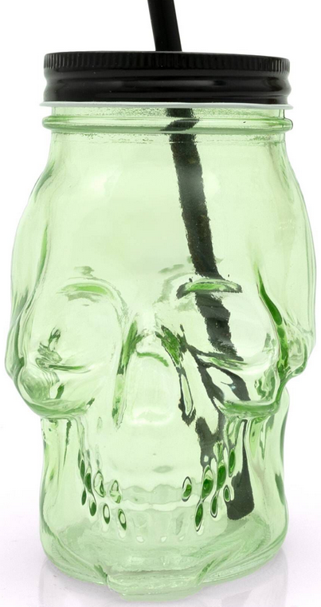
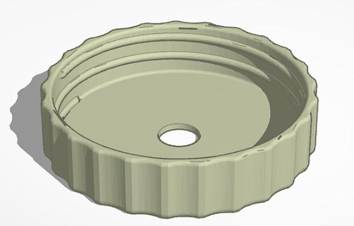
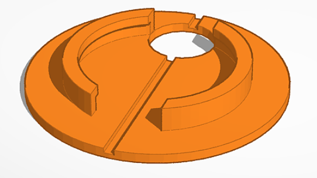
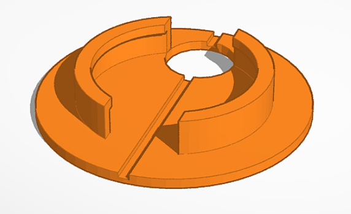
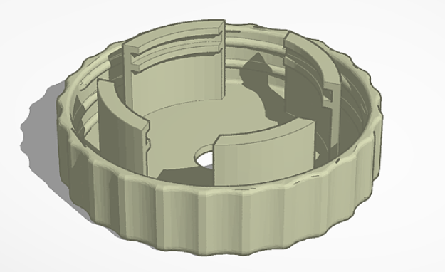

# 3D Models for the skull jars

The original skull jars were purchased from [Hobbyraft](https://www.hobbycraft.co.uk/)
for around £2 each and have a mason jar typescrew lid. They are green but we also got
some orange ones. Here is a [link](https://www.hobbycraft.co.uk/light-green-skull-drinking-jar-/6701041003.html).

## Skull jar lids

To make the skulls more waterproof and the fittings just generally better, I bought
a fairly basic 3D Printer ([Creality Ender V3 SE](https://www.creality.com/products/creality-ender-3-v3-se)).

I started with searching on [Thingiverse](https://www.thingiverse.com/) and found the
model [Mason Jar Straw Lid by QWERTZ](https://www.thingiverse.com/thing:4432681). I
used that as the basis of my work.

The first change I made was to increase the diameter of the straw hole to 12 mm to
allow me to fit the [12mm cable glands](https://www.amazon.co.uk/gp/product/B07JH2LPZF/ref=ppx_yo_dt_b_search_asin_title?ie=UTF8&th=1)
that will be used to route some [3-core cable](https://www.amazon.co.uk/gp/product/B07HHLGVH5)
through the top. The tool I used to modify the models was [Tinkercad](https://www.tinkercad.com/).

## Neopixel ring clip

In the lid of the skull jars there will be a
[32mm Neopixel ring](https://coolcomponents.co.uk/products/8-led-32mm-ring-ws2812b-5050-rgb-led-with-integrated-drivers-adafruit-neopixel-compatible)
containing 8 lovely bright Neopixel compatible LEDs which I purchased from the amazing
[Cool Components](https://coolcomponents.co.uk/). To be able to mount the Neopixel ring
neatly in the top, I designed a simple Neopixel clip in two variants, normal and taller.
The normal clip gives a nice flush tight finish but is a bit fiddly to get in. The taller
one allows more movement and is simpler.

 

## Attaching the Neopixel rings to the jar lid

Holding the Neopixel ring clip in place required another clip that went from the jar lid and
extended downwards. There needs to be enough space between the jar lid and the Neopixel clip
to connect everything up so I experimented with different heihgts and settled on a lowish profile
that did not extend too far below the top of the skull jar.

This clip was then attached to the jar lid to make a single model that can be printed.

## Wiring everything up

Space between the jar lid and the Neopixel ring clip is tight but when assembled gives a nice
neat finish. To connect the incoming 3-core wire to the Neopixel ring I used an electrical
connector block. The ones I used were simple 3 amp ones that can be purchsed from any electrical
retailer. I got mine online from [Amazon here](https://www.amazon.co.uk/gp/product/B0BTPFWNVF).

The Neopixel rings come with JST SM connectors already attached. The simplest method to
attach the Neopixel ring to the 3-core cable is to buy some extra [JST SM connectors](https://www.amazon.co.uk/gp/product/B07K2L814N)
For simplicity, you can cut the output connector off the Neopixel ring and use that
but as I wanted to reuse my Neopixel rings for other projects, I bought some extra
connectors.

## All 3D model files

* [Mason Jar with 12mm hole](./Mason_jar_12mm_hole.stl)
* [Neopixel ring clip, normal](./Neopixel_ring_holder_52mm_base.stl)
* [Neopixel ring clip, taller](./Neopixel_ring_holder_52mm_base_tall.stl)
* [Neopixel clip holder](./Neopixel_ring_holder_57mm_clip.stl)
* [Mason jar with Neopixel clip holder](./Mason_jar_id_with_57mm_clip.stl)

## Bill of materials

There are 12 skulls in total (6 skulls on each side of the path).
You will need to purchase enough items to build all 12 skulls.

* [3-core cable](https://www.amazon.co.uk/gp/product/B07HHLGVH5)
* [Skull jar](https://www.hobbycraft.co.uk/light-green-skull-drinking-jar-/6701041003.html)
* [12mm cable glands](https://www.amazon.co.uk/gp/product/B07JH2LPZF/ref=ppx_yo_dt_b_search_asin_title?ie=UTF8&th=1) 
* [32mm Neopixel ring](https://coolcomponents.co.uk/products/8-led-32mm-ring-ws2812b-5050-rgb-led-with-integrated-drivers-adafruit-neopixel-compatible)
* [Terminal blocks](https://www.amazon.co.uk/gp/product/B0BTPFWNVF)
* [JST SM connectors](https://www.amazon.co.uk/gp/product/B07K2L814N)
* [Mason jar with Neopixel clip holder](./Mason_jar_id_with_57mm_clip.stl)
* [Neopixel ring clip, normal](./Neopixel_ring_holder_52mm_base.stl)
